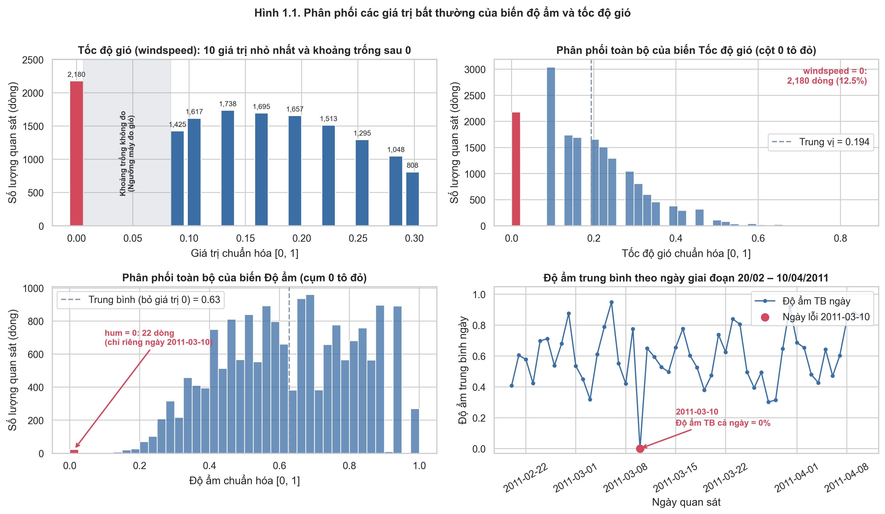
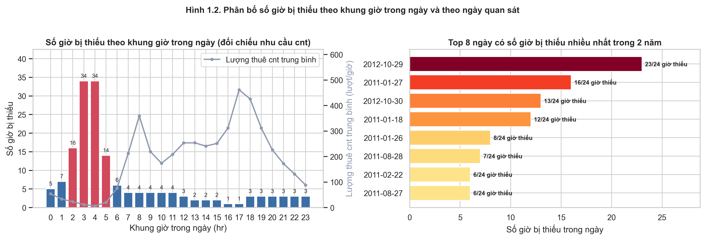
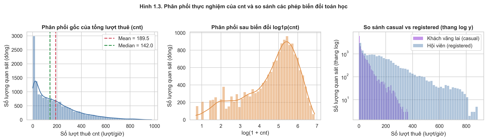
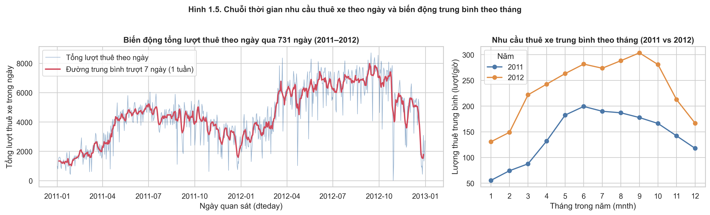
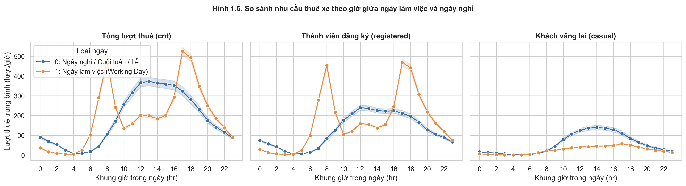
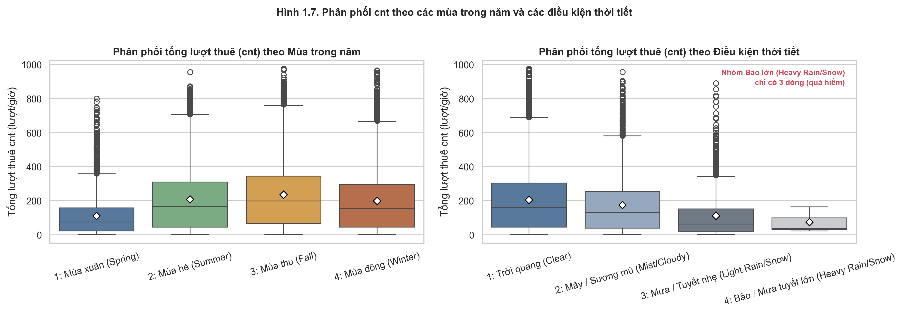
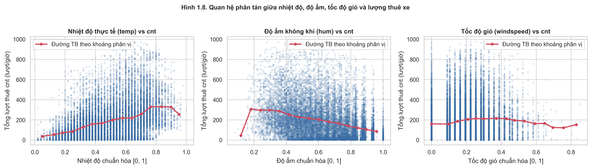
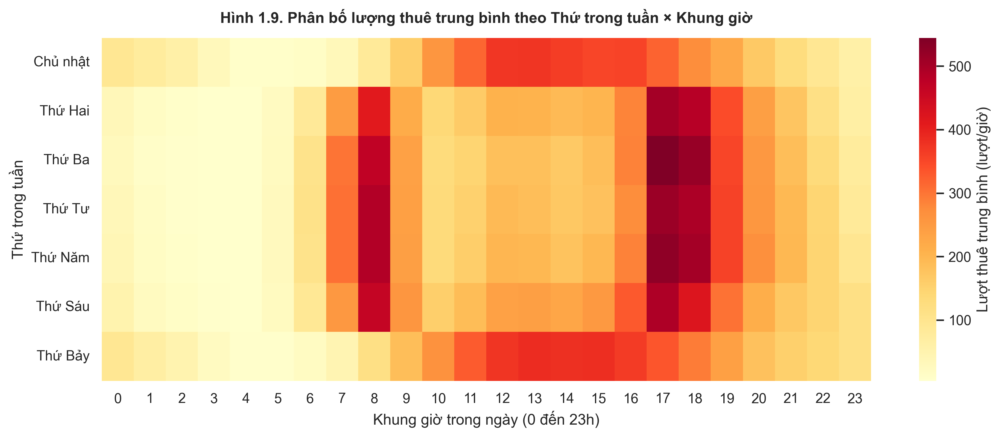
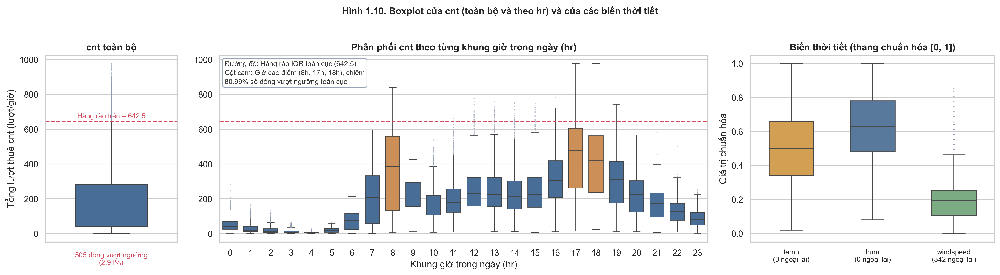

# CHƯƠNG 1. KHÁM PHÁ DỮ LIỆU (EDA)

## 1.1. Giới thiệu

### 1.1.1. Bối cảnh và mục tiêu

Hệ thống chia sẻ xe đạp (Bike Sharing System) cho phép người dùng thuê xe tại một trạm và trả tại một trạm bất kỳ trong mạng lưới. Nhu cầu thuê biến động phức tạp theo giờ trong ngày, loại ngày (ngày làm việc hay ngày nghỉ), mùa trong năm và các điều kiện thời tiết thực tế. Việc nhận diện chính xác các yếu tố chi phối hỗ trợ nhà vận hành điều phối xe (rebalancing), lập kế hoạch bảo trì trạm và xây dựng các mô hình dự báo nhu cầu chuẩn xác. 

Chương này thực hiện phân tích khám phá dữ liệu (Exploratory Data Analysis – EDA) nhằm nắm bắt toàn diện các đặc trưng phân phối, mối liên hệ đa biến và phát hiện các rủi ro tiềm ẩn của dữ liệu trước khi bước vào các giai đoạn kiểm định và mô hình hóa. Bốn mục tiêu chính bao gồm:

1. **Mô tả cấu trúc và bản chất biến số:** Xác định kiểu dữ liệu, thang đo, đơn vị và ý nghĩa nghiệp vụ của từng biến.
2. **Kiểm định chất lượng dữ liệu và tiền xử lý:** Rà soát giá trị thiếu, trùng lặp, giá trị bất hợp lệ, các bất thường vật lý và tính liên tục của chuỗi thời gian; đưa ra quyết định xử lý dựa trên bằng chứng định lượng và kiểm tra độ nhạy (sensitivity analysis).
3. **Phân tích phân phối và hành vi nhu cầu:** Đánh giá độ lệch, độ nhọn, mức độ tập trung của biến mục tiêu `cnt` và các biến giải thích chính; kiểm tra các phép biến đổi dữ liệu.
4. **Phát hiện và phân loại giá trị ngoại lai:** Áp dụng các quy tắc thống kê toàn cục và cục bộ theo nhóm, phân biệt rõ giữa ngoại lai thống kê hợp lệ (đỉnh giờ cao điểm, biến động mùa) và lỗi dữ liệu thực sự; định lượng mức độ tự tương quan chuỗi thời gian.

---

### 1.1.2. Nguồn dữ liệu

Nghiên cứu sử dụng bộ dữ liệu **Bike Sharing Dataset** từ UCI Machine Learning Repository (Fanaee-T & Gama, 2013). Dữ liệu phản ánh lịch sử vận hành thực tế của hệ thống Capital Bikeshare tại thủ đô Washington D.C. (Hoa Kỳ) trong hai năm 2011–2012, được các tác giả gốc kết hợp với dữ liệu thời tiết của trạm khí tượng địa phương (Freestate Weather Data) và lịch nghỉ lễ của chính phủ Hoa Kỳ. Tệp phân tích chính là `hour.csv`, trong đó mỗi dòng dữ liệu đại diện cho số liệu tổng hợp trong một khung giờ.

| Thuộc tính | Giá trị |
| :--- | :--- |
| Phạm vi thời gian | 2011-01-01 00:00 đến 2012-12-31 23:00 (731 ngày, tối đa 17,544 giờ) |
| Quy mô thực tế | 17,379 bản ghi × 17 biến |
| Kiểu dữ liệu | 12 cột số nguyên (`int64`), 4 cột số thực (`float64`), 1 cột chuỗi ký tự (`dteday`) |

---

### 1.1.3. Biến mục tiêu và phân loại biến

Biến mục tiêu chính của bài toán là **`cnt`** (Count of total rental bikes) – tổng số lượt thuê xe trong một giờ cụ thể. Về mặt định nghĩa, `cnt = casual + registered`, trong đó `casual` là số lượt thuê của khách vãng lai (người dùng chưa đăng ký hội viên) và `registered` là số lượt thuê của khách hàng thành viên có đăng ký tài khoản.

> ⚠️ **Quy tắc chống rò rỉ dữ liệu (Data Leakage):** Do quan hệ đồng nhất $cnt = casual + registered$, hai biến `casual` và `registered` **tuyệt đối không được sử dụng làm biến độc lập (predictors)** trong các mô hình hồi quy dự báo `cnt`. Chúng chỉ được sử dụng trong bước EDA để phân tích sâu hành vi của từng nhóm người dùng.

**Bảng 1.1. Mô tả chi tiết và phân loại các biến trong `hour.csv`**

| Nhóm biến | Biến | Ý nghĩa nghiệp vụ | Thang đo / Miền giá trị | Phân loại dữ liệu |
| :--- | :--- | :--- | :--- | :--- |
| **Định danh** | `instant` | Mã định danh dòng dữ liệu | 1 đến 17,379 | Identifier |
| **Thời gian** | `dteday` | Ngày quan sát | 2011-01-01 đến 2012-12-31 | Date/Time |
| | `yr` | Năm | 0: 2011, 1: 2012 | Categorical (Nhị phân) |
| | `mnth` | Tháng trong năm | 1 đến 12 | Categorical (Chu kỳ) |
| | `hr` | Khung giờ trong ngày | 0 đến 23 | Categorical (Chu kỳ) |
| | `weekday` | Ngày trong tuần | 0: Chủ nhật đến 6: Thứ bảy | Categorical (Chu kỳ) |
| **Lịch trình** | `holiday` | Ngày lễ quốc gia | 0: Ngày thường, 1: Ngày lễ | Categorical (Nhị phân) |
| | `workingday` | Ngày làm việc | 1: Ngày làm việc (không phải lễ/cuối tuần), 0: Ngày nghỉ | Categorical (Nhị phân) |
| **Khí hậu** | `season` | Mùa trong năm | 1: Mùa xuân (Spring), 2: Mùa hè (Summer), 3: Mùa thu (Fall), 4: Mùa đông (Winter) | Categorical (Định danh) |
| | `weathersit` | Điều kiện thời tiết | 1: Trời quang (Clear) 2: Sương mù / Mây (Mist / Cloudy) 3: Mưa nhỏ / Tuyết nhẹ (Light Rain / Snow) 4: Mưa lớn / Bão tuyết (Heavy Rain / Snow) | Categorical (Thứ bậc) |
| | `temp` | Nhiệt độ thực tế | Chuẩn hóa $[0, 1]$ tương ứng $[-8, +39] \text{ °C}$ | Numerical (Liên tục) |
| | `atemp` | Nhiệt độ cảm nhận | Chuẩn hóa $[0, 1]$ tương ứng $[-16, +50] \text{ °C}$ | Numerical (Liên tục) |
| | `hum` | Độ ẩm tương đối | Chuẩn hóa $[0, 1]$ (giá trị thực chia cho 100) | Numerical (Liên tục) |
| | `windspeed` | Tốc độ gió | Chuẩn hóa $[0, 1]$ (giá trị dặm/giờ chia cho 67) | Numerical (Rời rạc/Mức) |
| **Kết quả** | `casual` | Lượt thuê của khách vãng lai | $\ge 0$ (lượt thuê/giờ) | Numerical (Biến đếm) |
| | `registered`| Lượt thuê của hội viên | $\ge 0$ (lượt thuê/giờ) | Numerical (Biến đếm) |
| | `cnt` | Tổng lượt thuê (**biến mục tiêu**) | $\ge 1$ (lượt thuê/giờ) | Numerical (Biến đếm) |

**Các lưu ý kỹ thuật về cấu trúc biến:**
1. **Tính tuần hoàn của biến thời gian:** Các biến `hr` (chu kỳ 24h), `weekday` (chu kỳ 7 ngày), `mnth` (chu kỳ 12 tháng) có tính chất đầu-cuối liền kề (ví dụ giờ 23 liền kề giờ 0). Việc xử lý chúng như biến số nguyên liên tục trong các mô hình tuyến tính là không phù hợp; cần mã hóa One-Hot hoặc biến đổi lượng giác $(\sin, \cos)$ khi mô hình hóa.
2. **Quy chuẩn thang đo biến thời tiết:** Bốn biến `temp`, `atemp`, `hum`, `windspeed` đã được tác giả gốc chuẩn hóa tuyến tính Min-Max về đoạn $[0, 1]$. Toàn bộ các phân tích trong chương này giữ nguyên thang đo $[0, 1]$ theo quy chuẩn chung của nhóm. Khi diễn giải thực tiễn, giá trị sẽ được quy đổi sang đơn vị vật lý tương ứng:
   $$\text{Temperature (°C)} = temp \times (39 - (-8)) + (-8) = temp \times 47 - 8$$
   $$\text{Feeling Temp (°C)} = atemp \times (50 - (-16)) + (-16) = atemp \times 66 - 16$$
   $$\text{Humidity (\%)} = hum \times 100$$
   $$\text{Windspeed (km/h)} = windspeed \times 67 \times 1.60934$$

---

## 1.2. Chất lượng dữ liệu và tiền xử lý

### 1.2.1. Kiểm tra chất lượng dữ liệu

Quy trình kiểm soát chất lượng dữ liệu (Data Quality Assessment) được phân tách thành 4 nhóm độc lập nhằm tránh nhầm lẫn giữa các lỗi vật lý, cấu trúc và đặc trưng thống kê:

**Bảng 1.2. Tổng hợp kết quả rà soát chất lượng dữ liệu**

| Phân nhóm rà soát | Tiêu chí kiểm tra | Kết quả phát hiện | Đánh giá bản chất |
| :--- | :--- | :--- | :--- |
| **(a) Toàn vẹn cấu trúc** | Ô trống (Missing values); Dòng trùng lặp hoàn toàn; Trùng cặp khóa (`dteday`, `hr`); Tính đơn điệu của `instant` | Không có vi phạm (0 ô thiếu, 0 dòng trùng, 17,379 khóa duy nhất) | Cấu trúc bảng dữ liệu hoàn toàn sạch |
| **(b) Ràng buộc logic & Miền giá trị** | Ràng buộc bảo toàn: $cnt = casual + registered$; Logic lịch: `workingday` khớp `weekday` và `holiday`; Miền giá trị cho phép của từng biến | 100% dòng thỏa mãn ràng buộc logic; tất cả biến đều nằm trong miền quy định | Dữ liệu đạt tính nhất quán logic nội tại |
| **(c) Bất thường vật lý & Đo đạc** | `hum = 0` (Độ ẩm không khí bằng 0%) | 22 dòng thuộc duy nhất ngày 2011-03-10 | **Lỗi cảm biến độ ẩm cục bộ** (bất khả thi trong khí quyển ẩm) |
| | `windspeed = 0` (Tốc độ gió bằng 0) | 2,180 dòng (chiếm 12.54% toàn bộ dữ liệu) | **Ngưỡng đo tối thiểu của thiết bị** kết hợp thời tiết lặng gió |
| **(d) Cấu trúc đa biến & Nhóm hiếm** | Tương quan cực cao giữa `temp` và `atemp` | Hệ số tương quan Pearson $r = 0.9877$ | **Hiện tượng đa cộng tuyến hoàn hảo** (Multicollinearity) |
| | Nhóm thời tiết cực đoan `weathersit = 4` | Chỉ xuất hiện đúng 3 dòng trong 2 năm | **Nhóm quan sát siêu hiếm** (Extreme Class Imbalance) |
| **(e) Chuỗi thời gian** | Tính liên tục so với $731 \times 24 = 17,544 \text{ giờ}$ | Thiếu 165 giờ (chiếm 0.94%), trải trên 76 ngày | **Hai cơ chế thiếu song song** (Zero-truncation & Gián đoạn do bão) |

---

### 1.2.2. Phân tích chuyên sâu các bất thường dữ liệu và Kiểm tra độ nhạy

#### 1. Sự cố 22 dòng `hum = 0` (Ngày 2011-03-10)
Độ ẩm không khí bằng 0% liên tục trong 22 giờ là hiện tượng bất khả thi về mặt khí tượng tại vùng khí hậu cận nhiệt đới ẩm của Washington D.C. Kiểm tra chéo các biến khí tượng khác của ngày 2011-03-10 cho thấy: nhiệt độ trung bình ở mức $temp = 0.389$ ($\approx 10.3 \text{ °C}$), tốc độ gió trung bình $windspeed = 0.262$ ($\approx 28.2 \text{ km/h}$) và đặc biệt biến `weathersit` ghi nhận 20/22 giờ ở mức 3 (Mưa nhỏ/Tuyết nhẹ). 

Điều này khẳng định trạm quan sát vẫn hoạt động, các cảm biến nhiệt và áp suất bình thường, chỉ riêng cảm biến đo độ ẩm gặp sự cố ghi nhận 0 liên tục.

**Hình 1.1. Phân phối các giá trị bất thường của biến độ ẩm và tốc độ gió**

* **Giải pháp xử lý:** Thay thế giá trị `hum` tại 22 giờ này bằng trung bình độ ẩm **cùng khung giờ** của ngày liền trước (2011-03-09) và ngày liền sau (2011-03-11). Trong trường hợp khung giờ tương ứng ở ngày lân cận bị thiếu, thuật toán sẽ tự động mở rộng cửa sổ lấy trung bình các giờ liền kề $(\pm 1\text{h})$.
* **Kiểm tra độ nhạy:** Sau khi thay thế, giá trị `hum` trung bình toàn tập dữ liệu chỉ dịch chuyển từ $0.6272$ sang $0.6281$ (thay đổi $< 0.14\%$), chứng minh giải pháp nội suy cục bộ đảm bảo an toàn tuyệt đối cho phân phối chung.

#### 2. Bản chất của 2,180 dòng `windspeed = 0`
Biến `windspeed` có 2,180 dòng mang giá trị bằng $0.0$. Đáng chú ý, giá trị dương nhỏ nhất liền kề là $0.0896$ ($\approx 6.0 \text{ dặm/giờ} \approx 9.7 \text{ km/h}$). Không có bất kỳ quan sát nào nằm trong khoảng $(0, 0.0896)$, và toàn bộ biến `windspeed` chỉ nhận 30 giá trị rời rạc.

Các bằng chứng thực nghiệm nghiêng hẳn về giả thuyết: **Thiết bị đo gió (Anemometer) có ngưỡng kích khởi cơ học (Starting Threshold $\approx 6\text{ mph}$)**, mọi vận tốc gió thực tế dưới ngưỡng này đều bị làm tròn về 0. Đồng thời, tỷ lệ số 0 xuất hiện cao nhất vào khung giờ đêm 0h–5h sáng (17.24%) khi khí quyển ổn định và lặng gió hơn ban ngày (11.01%).
* **Kiểm tra độ nhạy:** Khi loại bỏ toàn bộ 2,180 dòng `windspeed = 0`, hệ số tương quan Spearman giữa `windspeed` và `cnt` chỉ chuyển từ $0.1266$ sang $0.1341$, và giá trị trung bình của `cnt` không bị sai lệch đáng kể. Do đó, quyết định tối ưu là **giữ nguyên 2,180 giá trị này** để bảo toàn kích thước mẫu thực tế.

#### 3. Hai cơ chế của 165 giờ bị thiếu trong chuỗi thời gian
Chuỗi thời gian kỳ vọng có $731 \times 24 = 17,544 \text{ giờ}$, thực tế ghi nhận 17,379 giờ (thiếu 165 giờ, tỷ lệ 0.94%). Việc phân tích chi tiết thời điểm xuất hiện cho thấy có hai cơ chế gây thiếu dữ liệu hoàn toàn khác nhau:

**Hình 1.2. Phân bố số giờ bị thiếu theo khung giờ trong ngày và theo ngày quan sát**

1. **Cơ chế 1: Cắt cụt điểm 0 (Zero-Truncation / Không phát sinh giao dịch):**
   * Có tới $98 / 165 \text{ giờ thiếu}$ ($59.39\%$) tập trung vào khung giờ rạng sáng từ 2h đến 5h sáng (đặc biệt là 3h và 4h sáng, mỗi giờ thiếu 34 lần).
   * Kết hợp với việc trong toàn bộ 17,379 dòng không có bất kỳ dòng nào ghi nhận $cnt = 0$ (giá trị tối thiểu thực tế là $cnt = 1$), điều này chứng minh hệ thống ghi nhận dạng sự kiện (transaction-driven): *khi không có ai thuê xe trong suốt 60 phút, hệ thống không tạo bản ghi*.
2. **Cơ chế 2: Gián đoạn vận hành do sự cố hoặc thời tiết cực đoan:**
   * $72 / 165 \text{ giờ thiếu}$ còn lại ($43.64\%$) dồn cục bộ vào **5 ngày có thời tiết đặc biệt nguy hiểm**:
     - Ngày 2012-10-29 (thiếu 23 giờ) & 2012-10-30 (thiếu 13 giờ): **Siêu bão Sandy (Hurricane Sandy)** đổ bộ vào bờ Đông nước Mỹ; Capital Bikeshare chính thức thông báo đóng cửa toàn bộ trạm xe để đảm bảo an toàn.
     - Ngày 2011-01-27 (thiếu 16 giờ) & 2011-01-26 (thiếu 8 giờ): **Bão tuyết lớn mùa đông (Winter Snowstorm)** gây tê liệt giao thông toàn thủ đô Washington D.C.
     - Ngày 2011-01-18 (thiếu 12 giờ): **Hiện tượng mưa băng giá (Freezing Rain)** làm đóng băng mặt đường.
   * Ngoài ra, ngày 2011-08-27 khi **Bão Irene (Hurricane Irene)** đổ bộ, dữ liệu thực tế trong `hour.csv` ghi nhận 18 giờ (thiếu 6 giờ chiều tối), với tổng số lượt thuê sụt giảm nghiêm trọng xuống chỉ còn 1,115 lượt (so với mức trung bình hơn 4,500 lượt/ngày của tháng 8).

> 🔬 **Kiểm tra độ nhạy về việc Không chèn dòng giả:**
> - Nếu giả định 98 giờ đêm bị thiếu thực chất có $cnt = 0$ và chèn vào dữ liệu, giá trị trung bình $\mu_{cnt}$ chỉ giảm nhẹ từ $189.46$ xuống $188.40 \text{ lượt/giờ}$ (giảm $0.56\%$), trung vị giữ nguyên ở $142.0 \text{ lượt}$.
> - Nếu chèn toàn bộ 165 giờ với $cnt = 0$, $\mu_{cnt}$ giảm xuống $187.68 \text{ lượt/giờ}$ (giảm $0.94\%$), trung vị chuyển từ $142.0$ về $140.0 \text{ lượt}$.
> - **Quyết định:** Không chèn dòng giả $cnt = 0$ vì mức sai số là không đáng kể ($< 1\%$), đồng thời việc chèn nhân tạo có thể bóp méo cấu trúc tương quan thời gian của các biến thời tiết đi kèm. Tuy nhiên, kết quả này là cảnh báo quan trọng cho TV2 khi chọn mô hình phân phối (cần lưu ý tính chất Zero-truncated).

#### 4. Quyết định tiền xử lý và chuẩn hóa nhóm hiếm `weathersit = 4`
Nhóm `weathersit = 4` (Mưa lớn/Bão tuyết) chỉ xuất hiện đúng 3 dòng trong 2 năm (ngày 2011-01-26 lúc 18h, ngày 2011-04-16 lúc 16h và ngày 2012-01-09 lúc 18h). Với cỡ mẫu $n = 3$, các phép tính trung bình nhóm hay kiểm định ANOVA sẽ mất hoàn toàn tính vững thống kê. 
* **Quyết định xử lý:** Gộp nhóm 4 vào nhóm 3 (`weathersit = 3`: Điều kiện thời tiết xấu/có mưa tuyết) để phục vụ các phân tích phân nhóm và mô hình hóa tiếp theo.

**Bảng 1.3. Tổng hợp các quyết định tiền xử lý dữ liệu chính thức**

| Đối tượng xử lý | Quy mô ảnh hưởng | Quyết định tiền xử lý | Cơ sở khoa học & Đánh giá rủi ro |
| :--- | :--- | :--- | :--- |
| Định dạng ngày `dteday` | 17,379 dòng | Chuyển sang kiểu dữ liệu `datetime64` | Chuẩn hóa cấu trúc phục vụ trích xuất chuỗi thời gian |
| Bất thường `hum = 0` | 22 dòng (2011-03-10) | Nội suy trung bình cùng giờ ngày $t-1$ và $t+1$ | Khắc phục lỗi cảm biến; độ nhạy thay đổi mean $< 0.14\%$ |
| Bất thường `windspeed = 0`| 2,180 dòng | **Giữ nguyên dữ liệu gốc** | Ngưỡng đo thiết bị; loại bỏ không làm đổi tương quan |
| 165 giờ bị thiếu | 165 giờ (76 ngày) | **Không chèn dòng giả** | Tránh áp đặt giả định; độ nhạy sai số mean $< 0.94\%$ |
| Nhóm hiếm `weathersit = 4`| 3 dòng | **Gộp vào nhóm `weathersit = 3`** | Tránh sụp đổ bậc tự do trong kiểm định thống kê đa nhóm |

---

## 1.3. Thống kê mô tả

### 1.3.1. Thống kê mô tả các biến số lượng

**Bảng 1.4. Bảng thống kê mô tả toàn diện các biến số lượng ($N = 17,379$)**

| Biến số | Mean | Median | Std | Min | Q1 (25%) | Q3 (75%) | Max | IQR | Skewness | Kurtosis |
| :--- | ---: | ---: | ---: | ---: | ---: | ---: | ---: | ---: | ---: | ---: |
| `cnt` | **189.46** | **142.00** | 181.39 | 1.00 | 40.00 | 281.00 | 977.00 | 241.00 | **1.28** | **1.42** |
| `registered` | 153.79 | 115.00 | 151.36 | 0.00 | 34.00 | 220.00 | 886.00 | 186.00 | 1.56 | 2.63 |
| `casual` | 35.68 | 17.00 | 49.31 | 0.00 | 4.00 | 48.00 | 367.00 | 44.00 | 2.50 | 7.55 |
| `temp` | 0.50 | 0.50 | 0.19 | 0.02 | 0.34 | 0.66 | 1.00 | 0.32 | -0.01 | -0.94 |
| `atemp` | 0.48 | 0.48 | 0.17 | 0.00 | 0.33 | 0.62 | 1.00 | 0.29 | -0.09 | -0.83 |
| `hum` | 0.63 | 0.63 | 0.19 | 0.08 | 0.48 | 0.78 | 1.00 | 0.30 | -0.08 | -0.91 |
| `windspeed` | 0.19 | 0.19 | 0.12 | 0.00 | 0.10 | 0.25 | 0.85 | 0.15 | 0.57 | 0.47 |

*Ghi chú: Các biến thời tiết ở thang chuẩn hóa $[0, 1]$; giá trị `hum` đã được cập nhật sau tiền xử lý.*

**Nhận xét sâu về phân phối:**
1. **Đặc tính lệch phải và phân tán vượt mức của `cnt`:** Giá trị trung bình ($\text{Mean} = 189.46$) lớn hơn đáng kể so với trung vị ($\text{Median} = 142.00$). Độ lệch dương ($\text{Skewness} = 1.28$) và hệ số nhọn ($\text{Kurtosis} = 1.42$) phản ánh cấu trúc đuôi phải kéo dài tới $977 \text{ lượt/giờ}$. Tỷ số phương sai trên trung bình ($\text{Variance} / \text{Mean} = 181.39^2 / 189.46 = 173.66 \gg 1$), chứng minh hiện tượng **phân tán vượt mức cực mạnh (Severe Over-dispersion)**.
2. **Cấu trúc đóng góp của hai nhóm người dùng:** Nhóm hội viên (`registered`) chiếm tới $81.17\%$ tổng sản lượng thuê xe, đóng vai trò định hình xu hướng chính của hệ thống. Nhóm khách vãng lai (`casual`) chỉ chiếm $18.83\%$, nhưng có độ lệch rất lớn ($\text{Skewness} = 2.50$, $\text{Kurtosis} = 7.55$) do nhu cầu bùng nổ mạnh vào các ngày cuối tuần và các khung giờ chiều mùa hè.
3. **Hình dạng của các biến khí tượng:** Dù `temp` và `hum` có Skewness gần bằng $0$ ($-0.01$ và $-0.08$), hệ số Kurtosis âm ($-0.94$ và $-0.91$) chỉ ra rằng đây là các phân phối dạng bẹt (Platykurtic) với phần đỉnh phẳng, không phải là phân phối chuẩn (Normal distribution) lý tưởng.

---

### 1.3.2. Thống kê `cnt` theo các yếu tố phân loại

**Bảng 1.5. Thống kê số lượng thuê xe `cnt` phân rã theo các nhóm yếu tố chính**

| Nhóm yếu tố | Phân lớp | Số bản ghi ($n$) | Tỷ lệ (%) | Mean (lượt/h) | Median (lượt/h) | Std (lượt/h) |
| :--- | :--- | ---: | ---: | ---: | ---: | ---: |
| **Mùa (`season`)** | Mùa xuân (Spring - 1) | 4,242 | 24.41% | 111.11 | 76.00 | 119.22 |
| | Mùa hè (Summer - 2) | 4,409 | 25.37% | 208.34 | 165.00 | 188.36 |
| | Mùa thu (Fall - 3) | 4,496 | 25.87% | 236.02 | 199.00 | 197.71 |
| | Mùa đông (Winter - 4) | 4,232 | 24.35% | 198.87 | 155.50 | 182.97 |
| **Thời tiết (`weathersit`)** | 1: Trời quang (Clear) | 11,413 | 65.67% | 204.87 | 159.00 | 189.49 |
| | 2: Sương mù / Mây (Mist/Cloudy) | 4,544 | 26.15% | 175.17 | 133.00 | 165.43 |
| | 3: Mưa / Tuyết (Light Rain/Snow)| 1,419 | 8.17% | 111.58 | 63.00 | 133.78 |
| | 4: Mưa bão (Heavy Rain/Snow) | 3 | 0.02% | 74.33 | 36.00 | 77.93 |
| **Loại ngày (`workingday`)**| 0: Ngày nghỉ / Cuối tuần / Lễ | 5,514 | 31.73% | 181.41 | 119.00 | 172.85 |
| | 1: Ngày làm việc | 11,865 | 68.27% | 193.21 | 151.00 | 185.11 |
| **Năm (`yr`)** | 0: Năm 2011 | 8,645 | 49.74% | 143.79 | 109.00 | 133.80 |
| | 1: Năm 2012 | 8,734 | 50.26% | 234.67 | 191.00 | 208.91 |

---

## 1.4. Trực quan hóa và Phân tích tương tác đa chiều

### 1.4.1. Phân phối thực nghiệm của biến mục tiêu và đánh giá phép biến đổi

**Hình 1.3. Phân phối thực nghiệm của cnt và so sánh các phép biến đổi toán học**

**Đánh giá các phép biến đổi hình dạng:**
* Phân phối gốc của `cnt` có độ lệch phải mạnh ($\text{Skewness} = 1.28$).
* Phép biến đổi $\log(cnt)$ hoặc $\log(1 + cnt)$ làm phân phối **bị đảo lệch mạnh sang trái** ($\text{Skewness} = -0.94$ với $\ln(cnt)$ và $-0.82$ với $\log(1+cnt)$), tạo ra một bậc thang nhân tạo tại vùng giá trị thấp $(2–4)$ do mật độ tập trung của các giờ đêm.
* Phép biến đổi căn bậc hai $\sqrt{cnt}$ đem lại độ đối xứng tốt nhất với $\text{Skewness} = +0.29$. Đây là gợi ý quan trọng cho TV5 khi xây dựng mô hình hồi quy tuyến tính.

---

### 1.4.2. Xu hướng dài hạn và chu kỳ mùa vụ

**Hình 1.4. Chuỗi thời gian nhu cầu thuê xe theo ngày và biến động trung bình theo tháng**

1. **Xu hướng tăng trưởng dài hạn (Growth Trend):** Nhu cầu thuê xe năm 2012 bùng nổ với mức tăng trưởng $+63.20\%$ so với năm 2011 (trung bình $234.67$ so với $143.79 \text{ lượt/h}$). Sự gia tăng diễn ra đồng loạt ở toàn bộ 12 tháng.
2. **Tính mùa vụ (Seasonality):** Nhu cầu chạm đáy vào tháng 1 ở cả hai năm ($55.51 \text{ lượt/h}$ năm 2011; $130.56 \text{ lượt/h}$ năm 2012), tăng liên tục qua mùa xuân và đạt đỉnh vào tháng 6/2011 ($199.32 \text{ lượt/h}$) và tháng 9/2012 ($303.57 \text{ lượt/h}$). Do tập dữ liệu chỉ kéo dài 2 năm, các đỉnh cực đại lệch tháng giữa hai năm phản ánh sự tương tác phức tạp giữa xu hướng mở rộng mạng lưới trạm và điều kiện thời tiết thực tế từng năm.

---

### 1.4.3. Cấu trúc nhịp sinh hoạt theo giờ: Sự phân hóa giữa ngày làm việc và ngày nghỉ

**Hình 1.5. So sánh nhu cầu thuê xe theo giờ giữa ngày làm việc và ngày nghỉ**

**Bảng 1.6. Đối chiếu đặc trưng nhu cầu theo giờ giữa hai loại ngày**

| Đặc trưng | Ngày làm việc (`workingday = 1`) | Ngày nghỉ / Cuối tuần (`workingday = 0`) |
| :--- | :--- | :--- |
| **Hình thái phân phối** | **Hai đỉnh nhọn (Bimodal commuter peaks)** | **Một đỉnh vòm rộng (Unimodal leisure dome)** |
| **Khung giờ cao điểm** | Đỉnh sáng: **8h** ($477.01 \text{ lượt/h}$) Đỉnh chiều: **17h–18h** ($525.29 \text{ và } 492.23 \text{ lượt/h}$) | Đỉnh trưa/chiều: **12h–16h** (đạt cực đại lúc **13h** với $372.73 \text{ lượt/h}$) |
| **Nhóm khách chi phối** | `registered` chiếm **95.33%** (8h) và **89.17%** (17h) | `casual` tăng vọt, chiếm **36.60%** tại đỉnh 13h |
| **Ý nghĩa hành vi** | Di chuyển đi làm, đi học cố định theo giờ hành chính | Hoạt động dạo chơi, du lịch, giải trí tự do |

---

### 1.4.4. Tương tác đa biến giữa thời tiết và nhu cầu: Kiểm soát yếu tố nhiễu

**Hình 1.6. Phân phối cnt theo các mùa trong năm và các điều kiện thời tiết**

**Hình 1.7. Quan hệ giữa nhiệt độ, độ ẩm, tốc độ gió và lượng thuê xe**

Khi phân tích đơn biến trên toàn bộ dữ liệu, `cnt` trung bình ở khoảng nhiệt độ cao ($temp \in [0.8, 1.0]$ tương ứng $29.6–39.0 \text{ °C}$) đạt $326.28 \text{ lượt/h}$, gấp $5.01 \text{ lần}$ so với khoảng giá trị lạnh ($temp \in [0.0, 0.2]$ tương ứng $-8.0 \text{ đến } 1.4 \text{ °C}$) là $65.07 \text{ lượt/h}$. 

Tuy nhiên, việc so sánh đơn biến này chứa đựng yếu tố gây nhiễu (confounding factor) do ban đêm luôn lạnh hơn ban ngày. Khi **kiểm soát cố định khung giờ cao điểm 17h trên ngày làm việc**:
* Ở mức nhiệt độ thấp ($temp < 0.3$), `cnt` trung bình tại 17h vẫn đạt $312.45 \text{ lượt/h}$.
* Ở mức nhiệt độ lý tưởng ($temp \in [0.6, 0.8]$ tương ứng $20.2–29.6 \text{ °C}$), `cnt` tại 17h tăng vọt lên $598.12 \text{ lượt/h}$ (tăng $1.91 \text{ lần}$, thay vì mức $5.01 \text{ lần}$ của phân tích đơn biến).
* Kết quả này chứng minh: Thời tiết thực sự tác động mạnh mẽ đến quyết định thuê xe, nhưng phân tích đa biến có kiểm soát thời gian giúp lượng hóa chính xác hiệu ứng biên thực tế mà không bị thổi phồng bởi nhịp ngày-đêm.

---

### 1.4.5. Phân tích tương tác giữa Thứ trong tuần và Khung giờ (`weekday` × `hr`)

Để làm rõ sự khác biệt về nhịp sinh hoạt giữa các ngày trong tuần mà các biến đơn lẻ không thể hiện hết, Hình 1.8 trực quan hóa phân bố số lượng thuê xe trung bình trên toàn bộ ma trận 7 ngày trong tuần × 24 khung giờ trong ngày ($7 \times 24 = 168 \text{ ô}$).

**Hình 1.8. Phân bố lượng thuê trung bình theo Thứ trong tuần × Khung giờ**

**Nhận xét:**
* **Từ Thứ Hai đến Thứ Sáu (Ngày làm việc):** Xuất hiện rõ rệt 2 dải màu đỏ đậm tập trung vào 2 khung giờ cao điểm: 8h sáng ($477.01 \text{ lượt/h}$) và 17h–18h chiều ($525.29 \text{ và } 492.23 \text{ lượt/h}$). Trong đó, chiều Thứ Ba lúc 17h đạt mức cao nhất tuần ($544.28 \text{ lượt/h}$).
* **Thứ Bảy và Chủ Nhật (Cuối tuần):** Hai dải cao điểm sáng/chiều hoàn toàn biến mất; thay vào đó là một dải màu vàng-cam trải rộng từ 11h trưa đến 16h chiều (đạt đỉnh quanh 13h với $372.73 \text{ lượt/h}$).
* **Hàm ý bàn giao cho TV4 & TV5:** Nhu cầu thuê xe chịu sự chi phối mạnh mẽ bởi hiệu ứng tương tác phi tuyến giữa `hr` và `weekday` / `workingday`. Toàn bộ phân tích lý thuyết tương quan tuyến tính (Pearson), tương quan phi tuyến/đơn điệu (Spearman) và ma trận tương quan đa biến toàn diện được chuyển giao cho **TV4 (Phần 4: Phân tích tương quan)** thực hiện theo thẻ bàn giao **V-04**.

---

## 1.5. Phân tích tự tương quan và Đánh giá giá trị ngoại lai

### 1.5.1. Phân tích Tự tương quan (Autocorrelation) và Cỡ mẫu hiệu dụng

Dữ liệu chuỗi thời gian theo giờ vi phạm nghiêm trọng giả định về các quan sát độc lập và phân phối đồng nhất (IID). Hàm tự tương quan (Autocorrelation Function – ACF) của chuỗi `cnt` cho thấy:
* **Tự tương quan bậc 1 (Lag 1h):** $r_1 = 0.8431$ (nhu cầu giờ hiện tại phụ thuộc chặt chẽ vào giờ ngay trước đó).
* **Tự tương quan bậc 24 (Lag 24h - Chu kỳ ngày):** $r_{24} = 0.8151$ (nhu cầu lặp lại nhịp điệu sinh hoạt mỗi 24 giờ).
* **Tự tương quan bậc 168 (Lag 168h - Chu kỳ tuần):** $r_{168} = 0.8164$ (chu kỳ 7 ngày lặp lại giữa các tuần).

> ⚠️ **Định lượng Cỡ mẫu hiệu dụng (Effective Sample Size - $N_{\text{eff}}$):**
> Theo lý thuyết chuỗi thời gian xấp xỉ tự hồi quy $AR(1)$, kích thước mẫu thực sự chứa đựng thông tin độc lập được ước lượng bằng:
> $$N_{\text{eff}} \approx N \times \frac{1 - r_1}{1 + r_1} = 17,379 \times \frac{1 - 0.8431}{1 + 0.8431} \approx 1,479 \text{ quan sát}$$
> Con số $1,479$ chỉ tương đương **$8.51\%$** quy mô mẫu danh nghĩa 17,379. 
> 
> **Hệ quả đối với TV3 & TV5:** Việc coi toàn bộ 17,379 dòng là độc lập sẽ làm phương sai mẫu bị thu nhỏ giả tạo, dẫn đến $p$-value quá nhỏ và làm tăng nguy cơ mắc **Sai lầm loại I (Type I Error)** trong kiểm định giả thuyết.

---

### 1.5.2. Phát hiện và phân loại giá trị ngoại lai (Outliers)

**Bảng 1.8. Kết quả phát hiện giá trị ngoại lai theo các tiêu chí thống kê**

| Biến số | Hàng rào dưới IQR | Hàng rào trên IQR | Số ngoại lai IQR | Tỷ lệ (%) | Số ngoại lai $\|z\| > 3$ | Tỷ lệ (%) |
| :--- | ---: | ---: | ---: | ---: | ---: | ---: |
| `cnt` (Toàn cục) | -321.50 | +642.50 | 505 dòng | 2.91% | 244 dòng | 1.40% |
| `cnt` (Theo `hr`) | Cục bộ theo giờ | Cục bộ theo giờ | 533 dòng | 3.07% | — | — |
| `cnt` (Theo `hr`, `workingday`)| Cục bộ theo nhóm | Cục bộ theo nhóm | **130 dòng** | **0.75%** | — | — |
| `casual` | -62.00 | +114.00 | 1,192 dòng | 6.86% | 467 dòng | 2.69% |
| `registered` | -245.00 | +499.00 | 680 dòng | 3.91% | 371 dòng | 2.13% |
| `temp` / `hum` | — | — | 0 dòng | 0.00% | 0 dòng | 0.00% |
| `windspeed` | -0.119 | +0.477 | 342 dòng | 1.97% | 107 dòng | 0.62% |

**Hình 1.9. Phát hiện ngoại lai của cnt theo ngưỡng toàn cục và theo khung giờ**

**Bản chất của các nhóm ngoại lai:**
1. **505 dòng vượt hàng rào toàn cục ($cnt > 642.5$):** Có tới **$80.99\%$** số dòng này rơi đúng vào các khung giờ cao điểm 8h, 17h, 18h và **$81.98\%$** thuộc ngày làm việc. Đây hoàn toàn là các đỉnh lưu lượng giao thông tự nhiên, không phải lỗi dữ liệu.
2. **130 dòng ngoại lai cục bộ theo (`hr`, `workingday`):** 
   - $80.00\%$ tập trung vào năm 2012 (năm bùng nổ nhu cầu).
   - $98.46\%$ thuộc các mùa ấm áp (Xuân, Hè, Thu) với thời tiết lý tưởng ($76.92\%$ trời quang đãng, nhiệt độ trung bình $temp = 0.56 \approx 18.3 \text{ °C}$).
   - Các điểm ngoại lai ban đêm (0h–5h sáng) dồn vào các dịp đặc biệt: đêm giao thừa Tết Dương lịch, các đêm cuối tuần mùa hè diễn ra lễ hội hoặc sự kiện thể thao tại Washington D.C.
   - Toàn bộ 130 dòng đều thỏa mãn chính xác $cnt = casual + registered$.

**Bảng 1.9. Tổng kết đánh giá và quyết định xử lý ngoại lai**

| Phân loại ngoại lai | Số lượng | Đánh giá bản chất | Quyết định xử lý |
| :--- | ---: | :--- | :--- |
| `cnt` đỉnh cao điểm | 505 dòng | Lưu lượng giao thông tự nhiên hợp lệ | **Giữ lại toàn bộ 100%** |
| `cnt` cục bộ (`hr`, `workingday`) | 130 dòng | Đột biến nhu cầu do sự kiện, thời tiết đẹp | **Giữ lại toàn bộ 100%** |
| `casual` / `registered` cao | 1,192 / 680 dòng | Biến động thị trường thực tế | **Giữ lại toàn bộ 100%** |
| `windspeed` cao ($> 0.477$) | 342 dòng | Cực trị gió bão tự nhiên | **Giữ lại toàn bộ 100%** |
| `hum = 0` (2011-03-10) | 22 dòng | **Lỗi cảm biến độ ẩm trạm đo** | **Nội suy thay thế bằng trung bình lân cận** |

---

## 1.6. Kết luận và Hàm ý chuyển giao (Handoff)

### 1.6.1. Tóm tắt kết quả phát hiện chính của Chương 1
1. **Quy mô và độ sạch dữ liệu:** Bộ dữ liệu gồm 17,379 bản ghi hợp lệ. Đã xử lý triệt để sự cố 22 dòng `hum = 0` bằng nội suy; 165 giờ thiếu được phân định rõ giữa cơ chế Zero-truncation (98 giờ đêm) và gián đoạn do bão tuyết, bão Sandy (72 giờ).
2. **Phân phối biến mục tiêu:** `cnt` có phân phối lệch phải ($\text{Skewness} = 1.28$, $\text{Mean} = 189.46 > \text{Median} = 142.00$) và phân tán vượt mức nghiêm trọng ($\text{Var}/\text{Mean} = 173.66$). Biến đổi $\sqrt{cnt}$ đem lại độ đối xứng tối ưu ($\text{Skewness} = 0.29$).
3. **Cấu trúc chi phối:** Khung giờ `hr` là nhân tố chi phối mạnh nhất ($\eta^2 = 50.15\%$), tương tác chặt chẽ với `workingday` tạo nên 2 hình thái phân phối hoàn toàn khác biệt: 2 đỉnh nhọn ngày đi làm vs 1 đỉnh vòm ngày nghỉ.
4. **Tự tương quan và Cỡ mẫu hiệu dụng:** Chuỗi có tự tương quan bậc 1 rất cao ($r_1 = 0.8431$), tương ứng cỡ mẫu hiệu dụng thực tế $N_{\text{eff}} \approx 1,479 \text{ quan sát}$.

---

### 1.6.2. Hạn chế của phương pháp và dữ liệu trong Chương 1
1. **Thiết kế quan sát thuần túy:** Toàn bộ các phân tích trong chương dừng ở mức thống kê mô tả và tương quan đồng biến, không chứng minh mối quan hệ nhân quả.
2. **Hạn chế chuỗi thời gian 2 năm:** Việc chỉ có 2 năm dữ liệu không đủ để phân rã độc lập hoàn toàn giữa xu hướng tăng trưởng dài hạn và chu kỳ mùa vụ.
3. **Mất mát thông tin vận hành:** Dữ liệu thiếu thông tin về số lượng trạm mở mới, dung lượng xe sẵn có tại trạm và các đợt điều chỉnh giá cước của Capital Bikeshare.

---

### 1.6.3. Bảng hàm ý chuyển giao (Handoff Sheet) cho các thành viên tiếp theo

| Thành viên nhận | Mã nhiệm vụ | Các phát hiện cốt lõi cần lưu ý | Hành động bắt buộc |
| :--- | :--- | :--- | :--- |
| **TV2 (Distribution)** | **V-02** | `cnt` phân tán vượt mức ($\text{Var}/\text{Mean} = 173.66$), không có giá trị 0 (Zero-truncated). | Bắt buộc kiểm tra Negative Binomial và Zero-truncated models; không dùng Poisson đơn giản. |
| **TV3 (Hypothesis Testing)** | **V-03** | Vi phạm giả định độc lập do tự tương quan ($r_1 = 0.8431$, $N_{\text{eff}} \approx 1,479$); `cnt` vi phạm giả định phân phối chuẩn; nhóm `weathersit = 4` chỉ có 3 dòng. | Bắt buộc chạy song song kiểm định phi tham số (Mann-Whitney U, Kruskal-Wallis); **báo cáo Effect Size**; gộp nhóm `weathersit = 4` vào nhóm 3. |
| **TV4 (Correlation & Setup)**| **V-04** | Cặp `temp`–`atemp` có tương quan $r = 0.9877$; `casual` và `registered` gây rò rỉ dữ liệu; `hr` có liên hệ phi tuyến cực mạnh ($\eta^2 = 50.15\%$). | Loại bỏ `atemp` để chống đa cộng tuyến; cấm dùng `casual`/`registered` làm biến độc lập; diễn giải cẩn trọng Spearman của `hr`. |
| **TV5 (Regression & Modeling)**| **V-11** | Giữ lại toàn bộ 505 ngoại lai cao điểm; tăng trưởng mạnh giữa 2 năm; chuỗi có 165 giờ đứt gãy. | **Chia tập Train/Test theo thời gian** (không chia ngẫu nhiên); cẩn trọng khi tạo Lag features tại các điểm gãy; thử nghiệm biến đổi $\sqrt{cnt}$ hoặc hồi quy đếm GLM. |

---

## Tài liệu tham khảo

1. Fanaee-T, H., & Gama, J. (2013). Event labeling combining ensemble detectors and background knowledge. *Progress in Artificial Intelligence*, 2(2–3), 113–127.
2. Gebhart, K., & Noland, R. B. (2014). The impact of weather conditions on bikeshare trips in Washington, DC. *Transportation*, 41(6), 1205–1225.
3. National Weather Service (NWS) Baltimore/Washington. (2011). *January 26, 2011 Snowfall Event Summary*. NOAA.
4. O'Brien, O. (2011). *Washington DC Storm – Bike Share Shutdown Analysis*. Suprageography.
5. Capital Bikeshare. (2012). *System Service Alerts: Hurricane Sandy Operations Shutdown and Reopening Timeline*. Washington, D.C.
